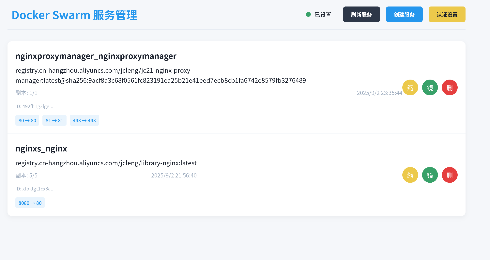
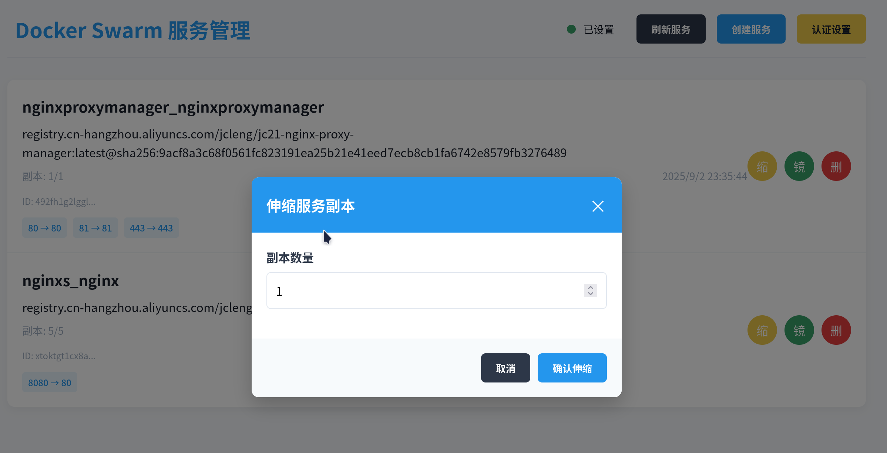
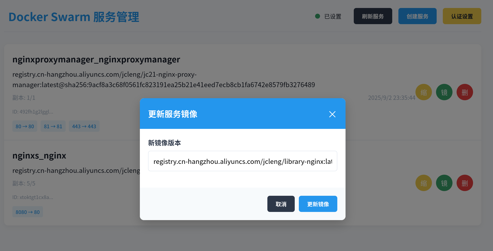
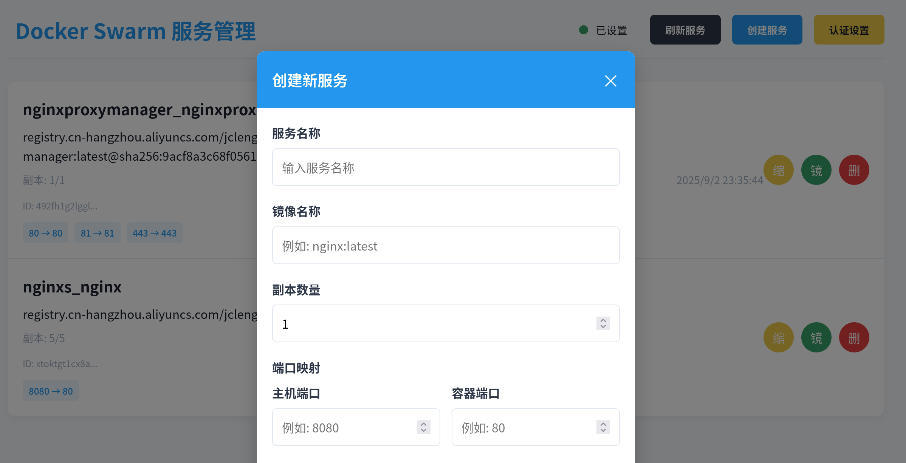

### 简易webui`docker swarm`模式部署服务






- 实现功能,适用于简单的web服务;推荐搭配`NginxProxyManager/nginx-proxy-manager`管理nginx

1.服务部署

2.pod缩放

3.镜像平滑更新/部署回滚/健康检查(使用容器内的curl命令)


- 初始化`swarm`模式

```shell
# 使用云服务商提供的内网地址初始化swarm模式
docker swarm init --advertise-addr 114.xx.xx.114
```

- 运行

```shell
# AUTHORIZATION设置的认证密码
docker run -itd \
  --name docker-swarm-service \
  --restart=always \
  --privileged \
  -p 8087:80 \
  -v /var/run/docker.sock:/var/run/docker.sock \
  -e AUTHORIZATION=admin888 \
  registry.cn-hangzhou.aliyuncs.com/jcleng/docker-swarm-service

```

- 访问,地址加上index.html

```
http://127.0.0.1:8087/index.html

# 查看当前节点, 其他工作节点可以加入
docker swarm join-token worker
```

- 开发-构建

```shell
docker build . -t registry.cn-hangzhou.aliyuncs.com/jcleng/docker-swarm-service
```
